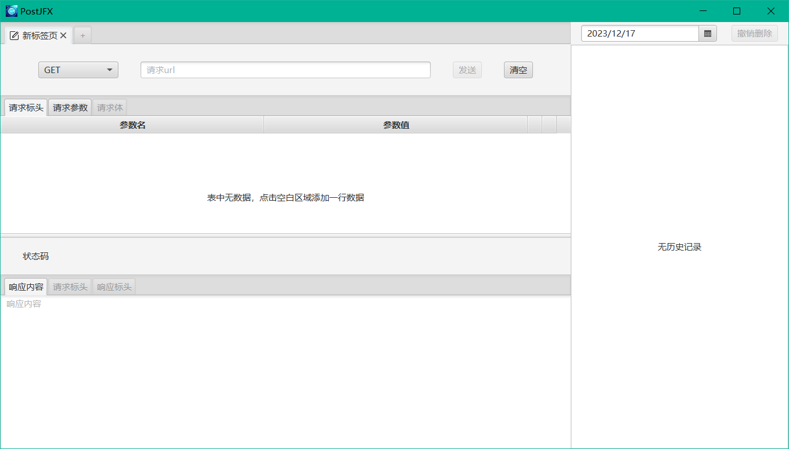

# PostJFX
> 一个基于JavaFX图形框架构建的简易Http请求工具，目前实现了`GET`, `POST`, `PUT`, `DELETE`四种Http请求方式

**注意事项**

1. 当表中没有数据行可以输入时，点击表格可以添加一行空数据
2. `GET`, `DELETE`请求不支持发送请求体以及上传文件
3. 历史记录信息存储在`~/PostJFX/logs/log.db`中

**native打包**

> `1.5.0`版本中新增了`com.gluonhq.gluonfx-gradle-plugin`打包插件，用于将项目使用`graalvm`提供的`native-image`打包

1. 运行`./gradlew run`在项目`resources`目录下生成反射配置文件，在主窗口把所有控件操作尽量全部执行一遍
2. 运行`./gradlew nativeBuild`构建native程序
3. 运行`./gradlew nativeRun`运行native程序，或者直接在目录`build/gluonfx/x86_64-windows`（不同系统目录可能会有差异）通过可执行文件运行

启动效果
